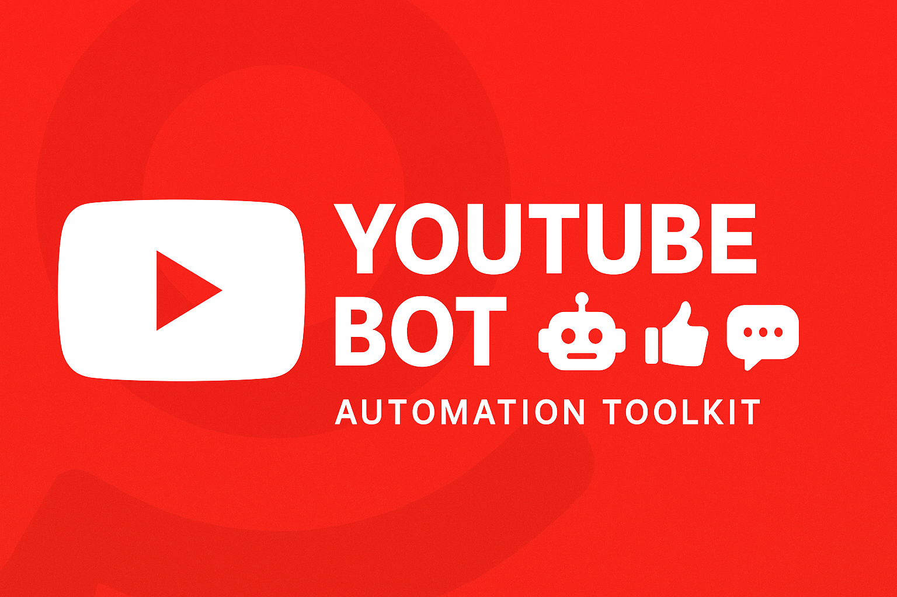

# youtube-bot

Automate YouTube engagement tasks like views, likes, comments, and subscriptions with ease.  
This project helps creators, marketers, and growth hackers save time, scale their campaigns, and run safer automation.  

<p align="center"> 
  <a href="https://github.com/yourusername/youtube-bot">
    
  </a> 
</p>

<p align="center">
  <a href="https://discord.gg/vBu9huKBvy">
    
  </a>
  <a href="https://t.me/devpilot1">
    
  </a>
</p>

---

## Introduction

**youtube-bot** is a powerful automation framework built to streamline YouTube growth and engagement.  
It allows you to run controlled automation for multiple accounts, enabling actions like watching videos, liking, subscribing, and posting comments.  
Perfect for agencies, content creators, and marketers managing campaigns at scale.  

### Key Benefits
- **Time-saving**: Automates repetitive YouTube actions.  
- **Scalable**: Run hundreds of accounts with proxy & multi-session support.  
- **Safer**: Uses stealth automation with browser fingerprinting & human-like actions.  

---

## Features

- Automated YouTube views, likes, comments, and subscriptions  
- Multi-account & multi-session support  
- Proxy rotation & anti-detect browser integration  
- Supports Playwright, Puppeteer, and Appium (real devices)  
- Configurable delays, actions, and targeting  
- CLI and Docker support for easy deployment  
- .env-based secure configuration  

---

<p align="center">
  
</p>


<p align="center">
  <a href="https://www.loom.com/share/b7734cf1455f4c018e469ee18a821c72" target="_blank" rel="noopener noreferrer">
    
  </a>
</p>
<p align="center">
  <a href="https://www.loom.com/share/b7734cf1455f4c018e469ee18a821c72" target="_blank" rel="noopener noreferrer">
    Click here to see the demo video
  </a>
</p>


## Use Cases

- Boost YouTube engagement (views, likes, comments, subs)  
- Manage multiple creator or marketing accounts at once  
- Run stealth campaigns with fingerprint-protected browsers  
- Warm-up new accounts with human-like actions  
- Test and monitor YouTube SEO growth strategies  

---

## Contact  

<p align="center">
  <a href="https://discord.gg/vBu9huKBvy">
    
  </a>
  <a href="https://t.me/devpilot1">
    
  </a>
</p>

---

## Installation

### Pre-requisites
- Node.js (>=16) or Python (>=3.9)  
- Docker (optional, for containerized runs)  
- Proxies (residential/mobile recommended)  

### Clone the repo
```bash
git clone https://github.com/yourusername/youtube-bot.git
cd youtube-bot
